---

marp: true
theme: gaia
size: 16:9
header: 'Leverage AI Tools to Accelerate Learning in Data Science'
footer: 'Matt Hamilton | ASIMOV Protocol'
-----------------------------------------

<!-- _class: lead -->

# Leverage AI Tools to Accelerate Learning in Data Science

**Matt Hamilton**
*Co-founder, Head of DevRel - ASIMOV Protocol*

---

<!-- paginate: true -->

# My Journey

**University** (CompSci) → **Netsight** → **enquos** → **IBM** → **Ripple** → **Protocol Labs** → **Arbitrum** → **ASIMOV**

- Moved to Barbados in 2020 on the Welcome Stamp during the pandemic
- Building blockchain/AI systems from here
- Paddleboarding with my dogs
- Wukkin up (with a concrete waistline)

---

# Today’s Plan

1. Context
1. Real Projects from Barbados
2. AI Tools You Can Use Today
3. ⚡ Prompting Challenge
4. Context Engineering
5. AI Toolkit
6. Careers & Next Steps

---

# Slides and Resources

 

[https://github.com/hammertoe/AIPromptingWorkshop/](https://github.com/hammertoe/AIPromptingWorkshop/)

---

# From Sugar Cane to Source Code

* Barbados exports: sugar cane, tourism, culture → what else can we export?
* AI is the great equalizer — all you need is a laptop and internet
* You can build tools the world uses, from right here

---

# The Context

> The AI revolution is not being written in Silicon Valley... 
> it's coming from Manila, from Bridgetown, from Nairobi

 Kate Kallot, Founder & CEO, Amini
 AI For Good Summit, 2025

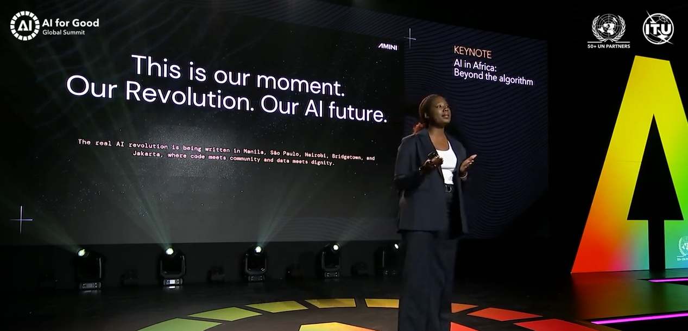

---
# The AI Revolution

* <1% of data centers in Africa (and none in Barbados!)
* Constraint = innovation
* Local context creates better AI

---

# The Great Shift

**Then:** You needed steel mills, factories, oil rigs
**Now:** Laptop + LLM + curiosity

Global competition has been democratized.

---

# Workshop Goals

✅ Use AI tools as creators, not just consumers
🛠️ Learn real-world prompting skills
🎯 Build smarter, not bigger
🌍 Solve local problems with global relevance

---

<!-- _class: lead -->

# Real Projects from Barbados

*Proof AI isn’t just for Silicon Valley*

---

# WeOutside246.com

**Problem:** Events scattered on IG
**Solution:** AI finds and structures event data

* LLMs (OpenAI) + Python
* Instagram scraping using Apify
* Event tagging & parsing
* Scheduled tasts run on Google Cloud Run

---

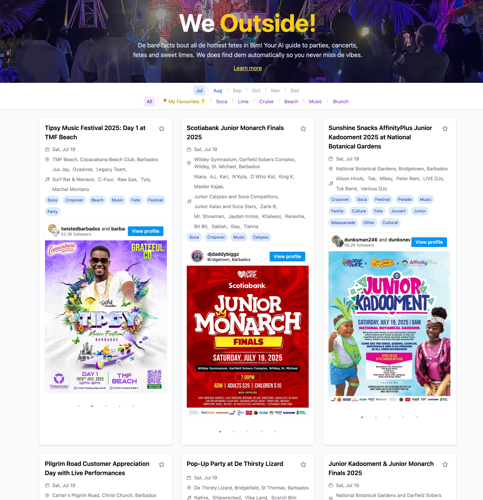  &nbsp; &nbsp; &nbsp; 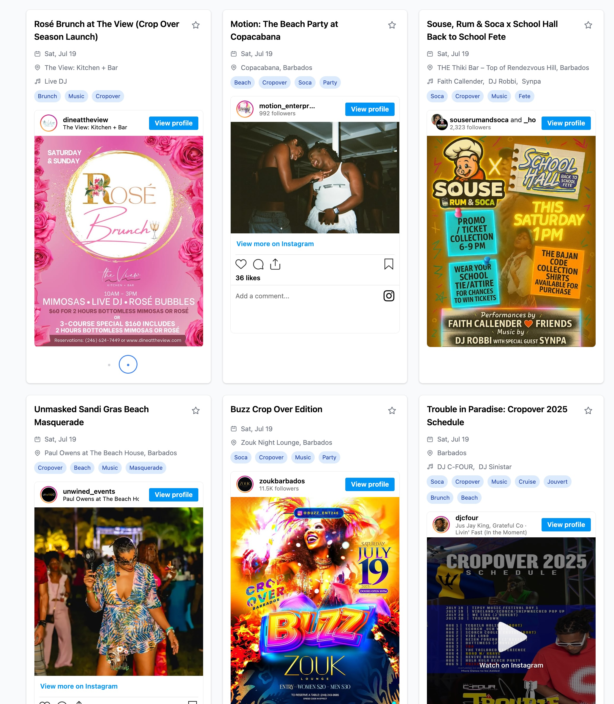

---
# LLM Data Extraction

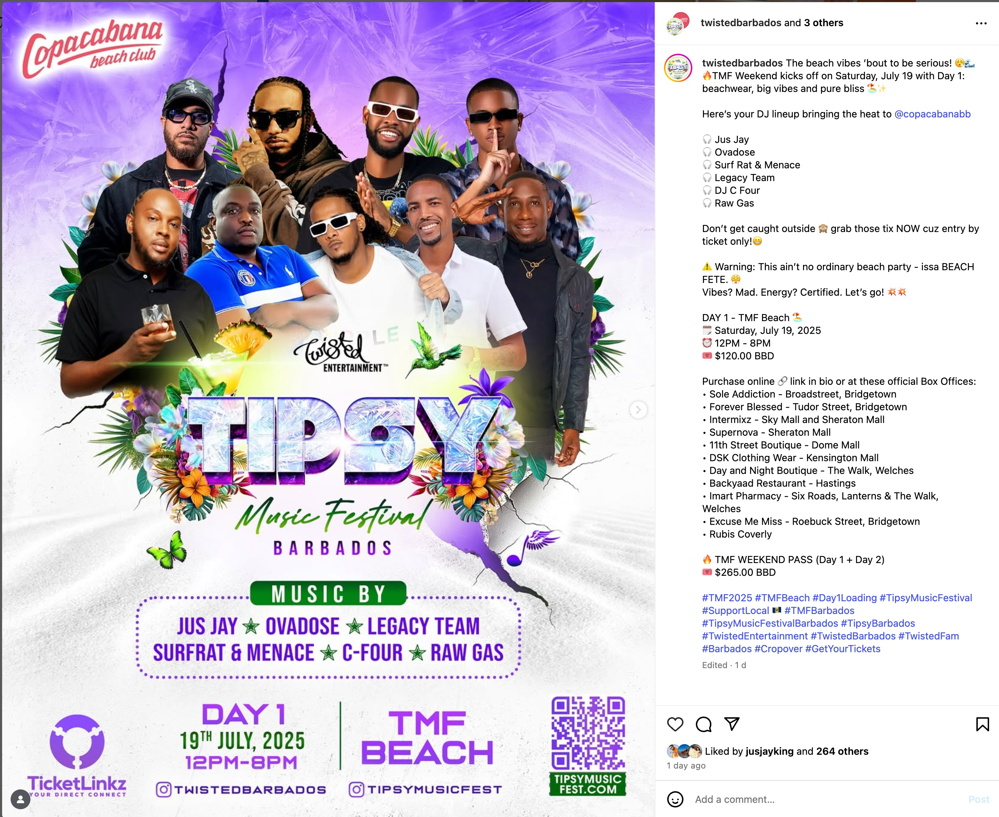  &nbsp; &nbsp; &nbsp; 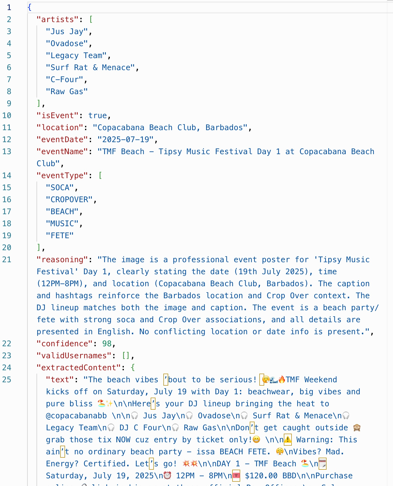

---

# YuhHearDem

**Problem:** Parliament transcripts are unreadable
**Solution:** AI makes them searchable & structured

* Gemini + LangChain + MongoDB
* Topic segmentation
* Queryable public record
* Links to YouTube videos

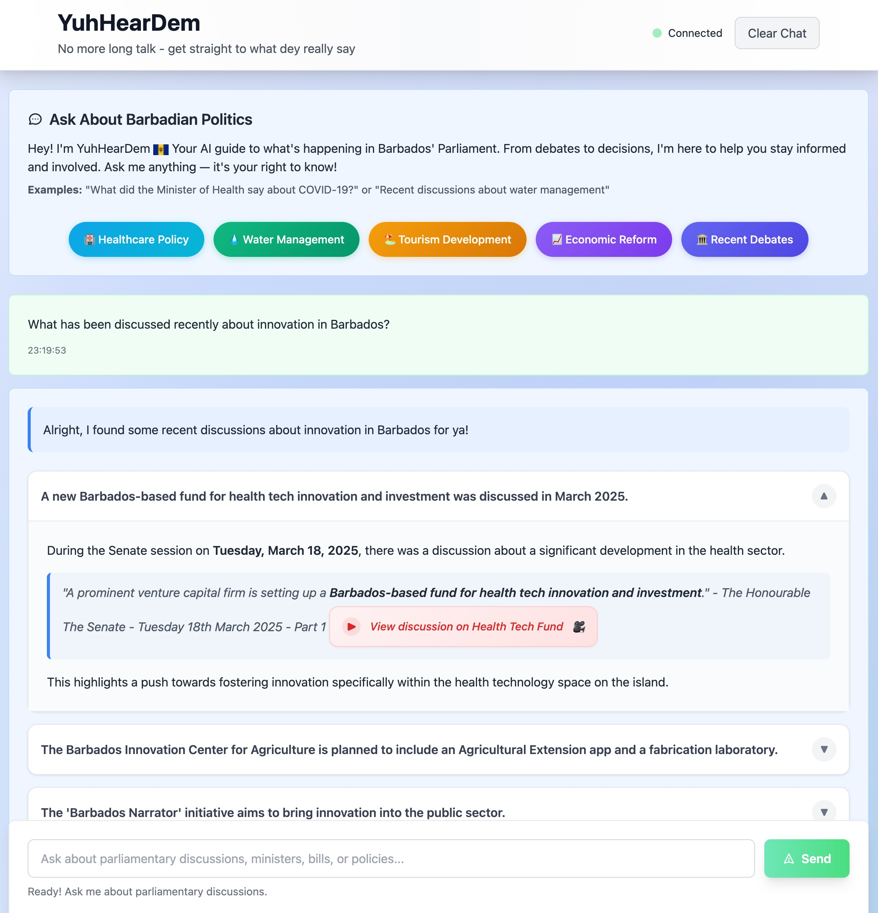

---

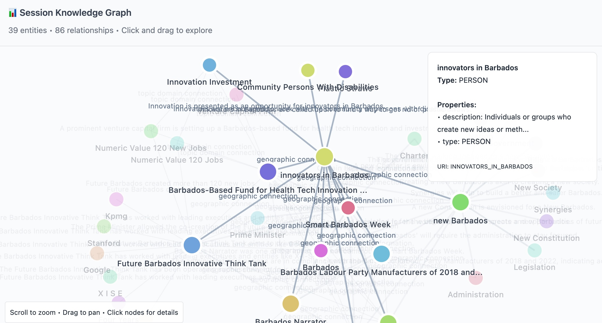

---

# ASIMOV Protocol

**Problem:** LLMs hallucinate & forget
**Solution:** Knowledge graphs for verifiable memory

* Structured data → trusted reasoning
* Knowledge graphs + LLMs = Neurosymbolic AI
* Built by a global team (incl. Barbados)

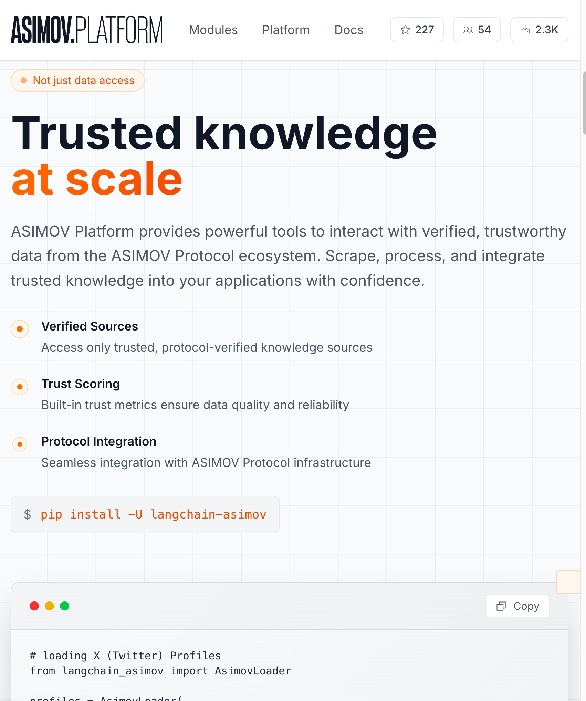

---

# Positron

**Problem:** Too many notes, no connections
**Solution:** AI that remembers what you learn

* Upload notes, docs, transcripts
* Ask smart, cross-topic questions
> Who do I know in Barbados who works in AI?

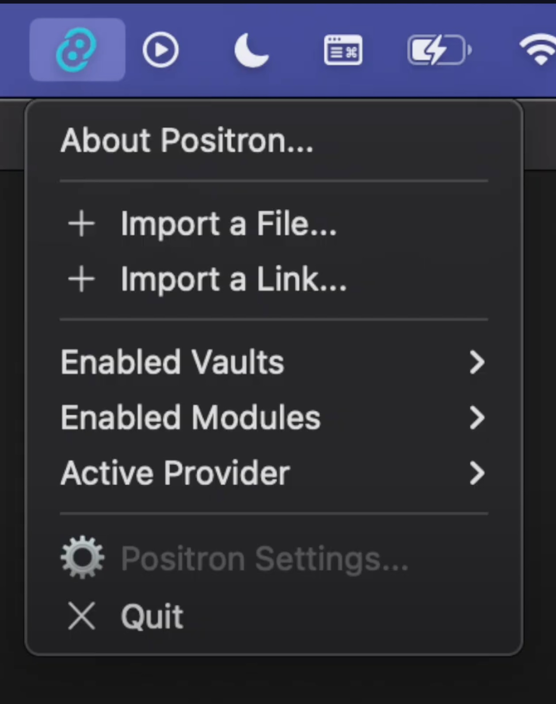

---

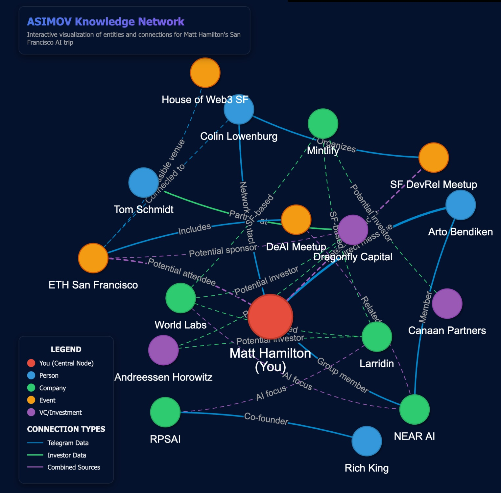  &nbsp; &nbsp; &nbsp; 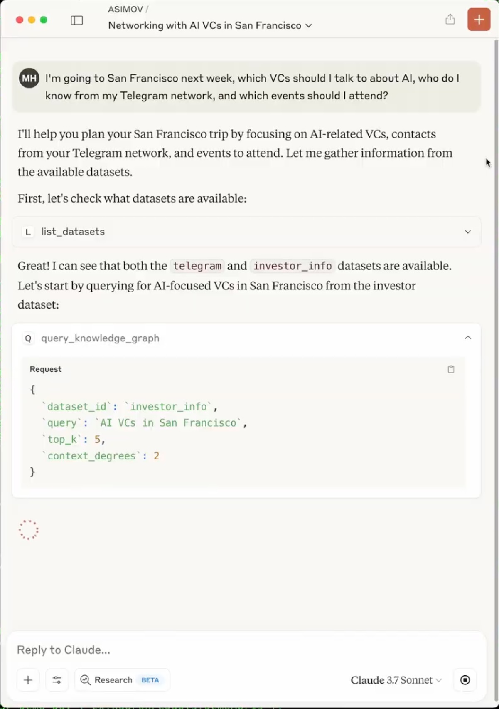

---

# Core Patterns

✅ Structured data > clever prompts
🎯 Solve real problems
🏝️ Local context = innovation edge
🛠️ Constraints drive creativity

---

<!-- _class: lead -->

# Prompting Skills

*Talk to AI like an engineer, not just a user*

---

# Prompting Techniques

✅ Be specific
✅ Give format/output type
✅ Use examples
✅ Refine iteratively
✅ Ask the LLM itself to improve a prompt!

🧪 Try:

> “Summarise this for a teenager from Barbados in 3 bullet points with 1 quote.”

---

# Prompt Evolution Example

❌ “Explain machine learning”
➡️ “Explain ML to a 16-year-old in Barbados with a mango analogy”
➡️ “Keep it under 150 words. Use bullets.”

---
<!-- _class: lead -->

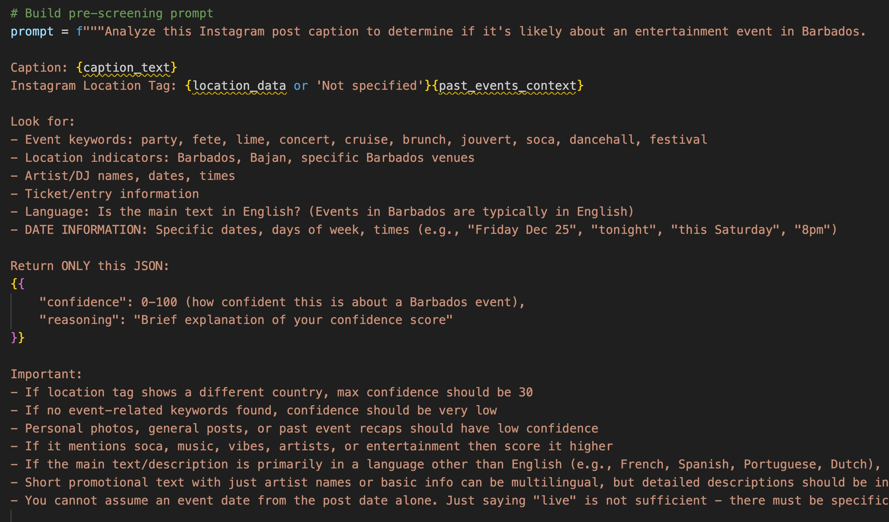

---

<!-- _class: lead -->

# Prompting Challenge

*Let’s see how well you can talk to an AI!*

---

# Clean the Data!

**Dataset Issues:**

* 🗓️ Mixed date formats
* 📞 Inconsistent phone numbers
* 📍 Location variations
* ❓ Missing values
* 🔢 Invalid entries

**Goal:** Write the best prompt to clean it all.

---

# Rules & Scoring

* ⏱️ 30 minutes
* 🔁 Unlimited submissions
* 🧠 Gemini 2.5 Pro will score
* 🏆 Best score wins!

**Scoring metrics:** Formatting, completeness, accuracy, structure

---
<!-- _class: lead -->

# bit.ly/bim-ai-workshop

---

<!-- _class: lead -->
# Context Engineering

*What the model knows when you prompt it.*

---

# What is Context Engineering?

“Prompting is what you say — context is what the model knows when you say it.”

**Context Engineering** means designing, structuring, and delivering the *right* information to an AI model at the *right* time.

Used to:
- Improve relevance, Reduce hallucination, Handle long documents, Personalize outputs

---

# Why Context Matters

🧠 LLMs have a messy "knowledge soup" that comes from their training by default.

They can't reason over information they haven't seen or can't access.

- If context is **messy**, **outdated**, or **too long**, results suffer  
- If it's **clean**, **focused**, and **structured**, you get great output

**Good context = better results**

---

# Ways to Engineer Context

**Basic methods:**
- Paste a doc into the prompt
- Few-shot examples
- System instructions

**Advanced tools:**
- RAG (Retrieval-Augmented Generation)
- Knowledge graphs

---

# Model Context Protocol (MCP)

**MCP** = a structured way to manage what the model sees

- Built at **Anthropic** (the people behind Claude)
- Works across Claude, Gemini, ChatGPT, etc.
- Makes inputs reliable, reusable, and traceable

Think of MCP as **“RAM for AI”** — structured, shared memory for LLMs

---

# What MCP Enables

✅ Plug-and-play context across models  
✅ Modular memory chunks (“What I know”, “Project data”)  
✅ Fewer hallucinations, better personalization

Use cases:
- Learning agents  
- Civic transparency tools (YuhHearDem)  
- Smart multi-agent workflows

---

<!-- _class: lead -->

# The AI Toolkit

*Build with what’s available today*

---

# LLMs Compared

| Tool    | Strengths          | Use Case        |
| ------- | ------------------ | --------------- |
| ChatGPT | Fast, general      | Drafting, Q\&A  |
| Claude  | Long context, code | Docs, debugging |
| Gemini  | Multimodal         | Tables, images  |

**Tip:** Pick the right tool for the right job

---

# Coding Agents

- Claude Code
- Cursor
- Lovable.ai
- Bolt.new

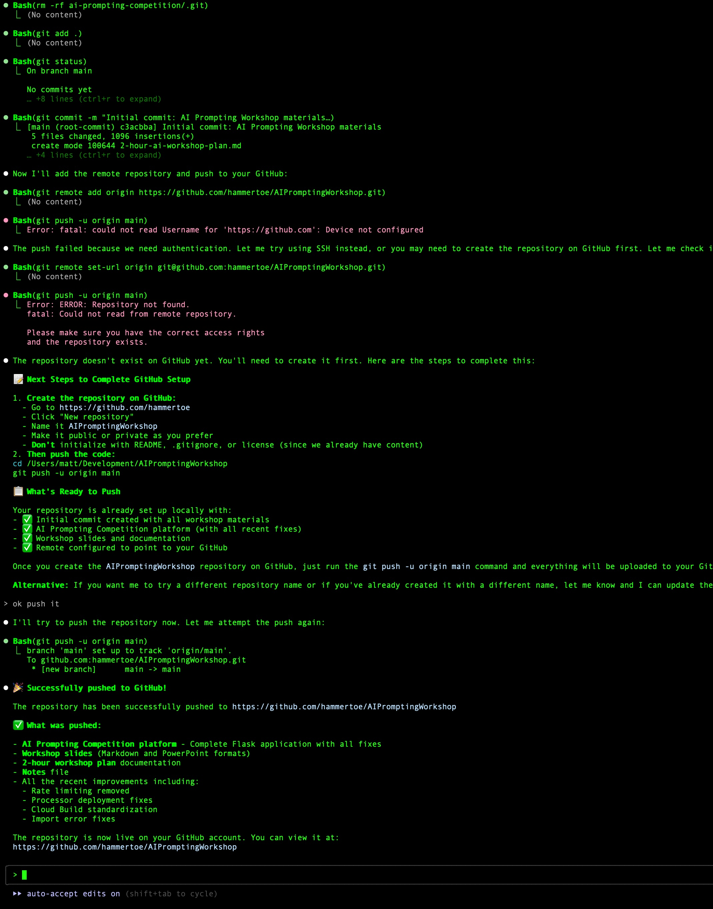

---
<!-- _class: lead -->

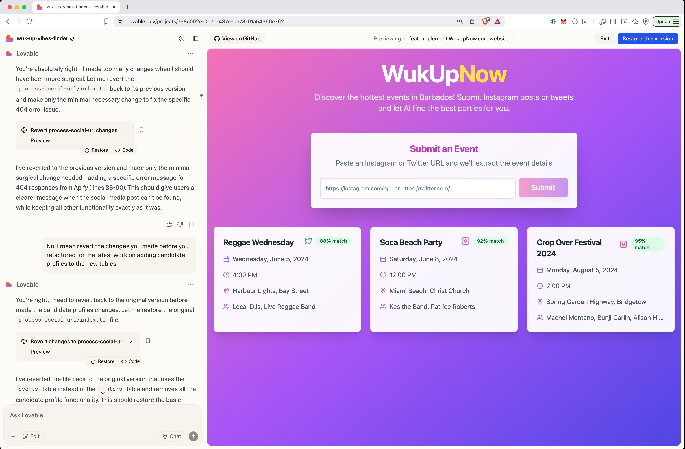 

---

# Embeddings & Search

* Convert text → numbers (vectors)
* Find related concepts, not just keywords

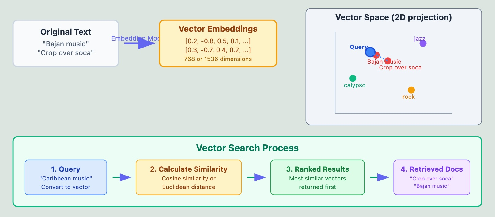 

---

# Knowledge Graphs

* Memory + structure = better answers
* Link facts, concepts, people

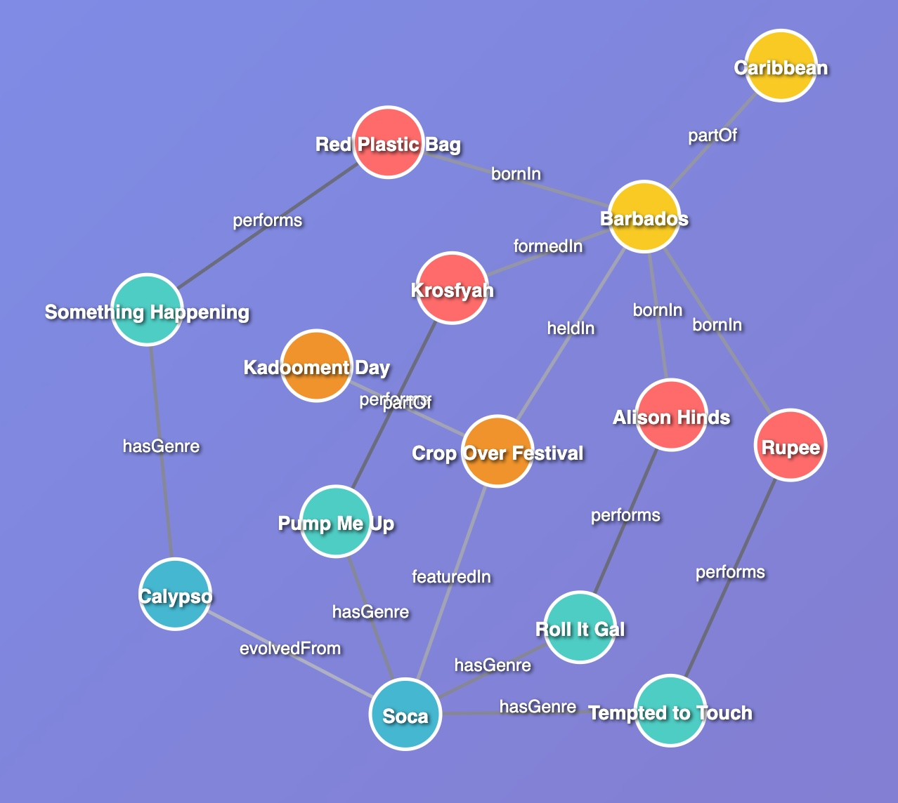 &nbsp; &nbsp; &nbsp; 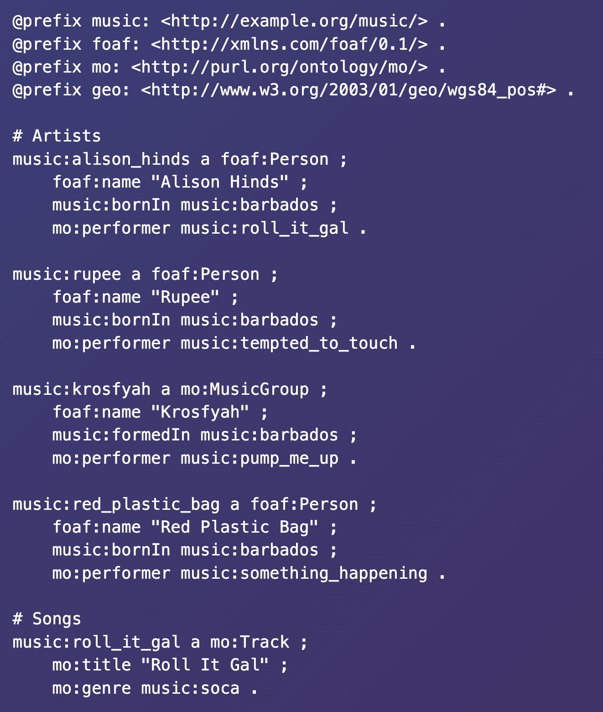

---

<!-- _class: lead -->

# Careers & Action

*How to build your future with AI*

---

# Build Your Portfolio

✅ 3–5 real projects on GitHub
✍️ Blog what you learn
🌍 Join communities
🚀 Work remote from Bim

---

# Final Takeaways

✅ Constraints are assets
✅ Local ideas can go global
✅ You don’t need permission
✅ Start building this week

---
<!-- _class: lead -->

# Your Turn

"The AI revolution is being written in Bridgetown."

🌟 What will *you* build?

Q & A
