---

marp: true
theme: gaia
size: 16:9
header: 'Context is Everything: From Barbados to AI Innovation'
footer: 'Matt Hamilton | Dharach'
-----------------------------------------

<!-- _class: lead -->

# Context is Everything: From Barbados to AI Innovation

**Matt Hamilton**
*Founder, Dharach - Civic Labs*

**March 17, 2026 | Protexxa**

---

<!-- paginate: true -->
<!-- _class: lead -->

# Who knows how to bake a cake?

---

# Two Types of Context

 &nbsp; &nbsp; &nbsp; 

**The context that changed my life:**
1. 🏝️ The context of being in Barbados
2. 🤖 The context we give to AI systems

---

<!-- _class: lead -->

# Act 1: My Journey
## Finding Context

---

# From Bristol to Barbados

- 2020: Came for the beaches, stayed for the opportunity
- Working at global tech companies (IBM, Ripple, Protocol Labs, Arbitrum Foundation) from a beach in Barbados
- **The revelation:** "If I can build world-class tech from here, why can't everyone?"

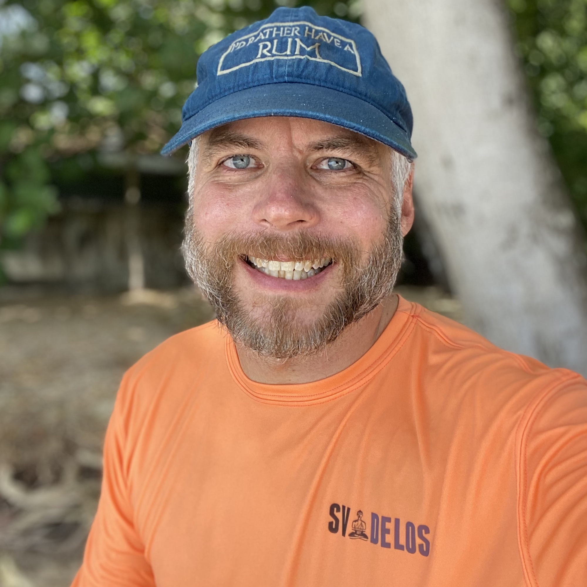

---

# My Journey

**University** (CompSci) → **Netsight** → **enquos** → **IBM** → **Ripple** → **Protocol Labs** → **Arbitrum** → **Dharach**

- Building blockchain/AI systems from Barbados
- Paddleboard meetings: Best brainstorming on water
- Wukkin up with a concrete waistline

---

# The Constraint Advantage

**No massive data centers?** → Build smarter systems
**No billion-dollar budgets?** → Solve real problems
**"Limited" resources?** → Unlimited creativity

"Necessity is the mother of invention" - and Barbados is full of mothers!

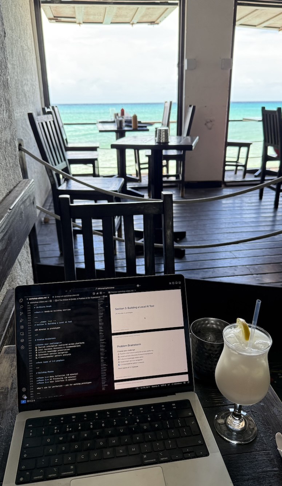

---

# Kate Kallot's Prophecy

"The AI revolution is not being written in Silicon Valley... 
it's coming from Manila, from **Bridgetown**, from Nairobi"

Kate Kallot, CEO of Amini
*Working with GovTech Barbados*

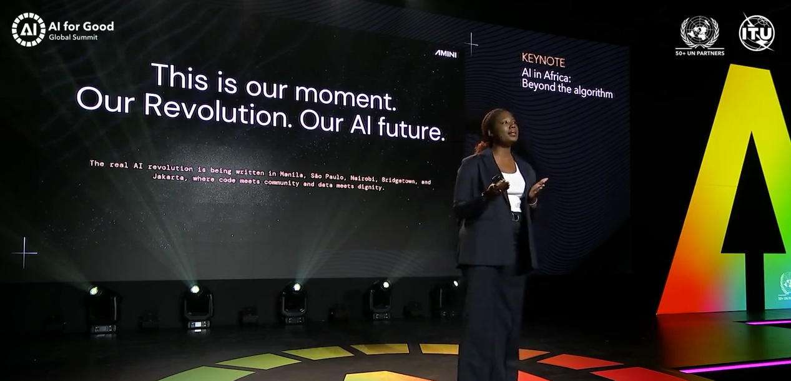

---

<!-- _class: lead -->

# Act 2: Local Problems, Local Solutions
## When Context Creates Innovation

---

# WeOutside246.com

**Problem:** Events scattered on IG
**Solution:** AI finds and structures event data

* LLMs (OpenAI) + Python
* Instagram scraping using Apify
* Event tagging & parsing
* Scheduled tasks run on Google Cloud Run

---

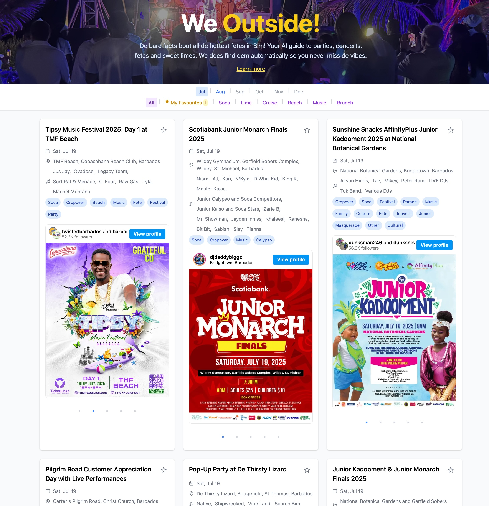  &nbsp; &nbsp; &nbsp; 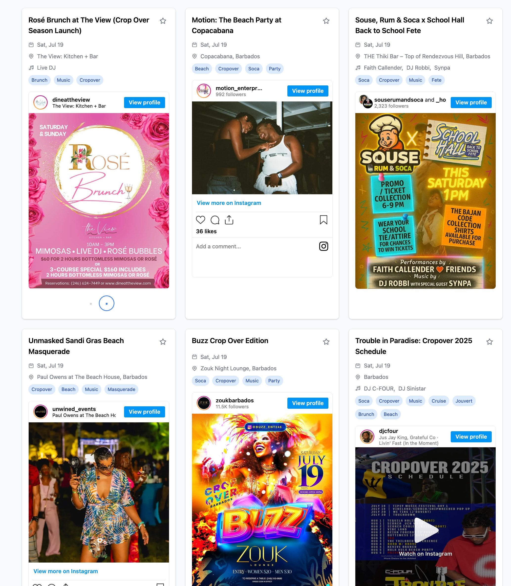

---
# LLM Data Extraction

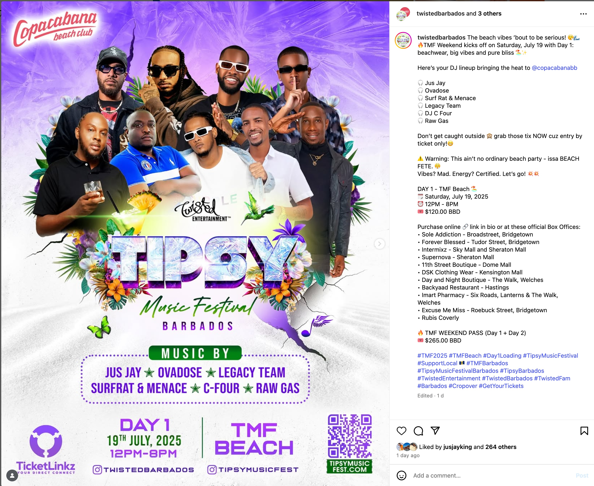  &nbsp; &nbsp; &nbsp; 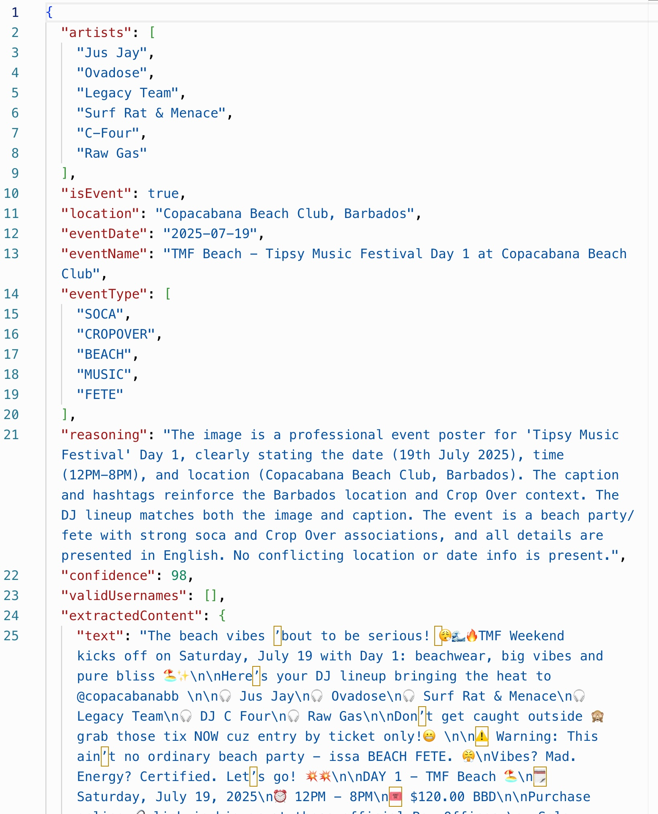

---

# YuhHearDem

**Problem:** Parliament transcripts are unreadable
**Solution:** AI makes them searchable & structured

* Gemini + LangChain + MongoDB
* Topic segmentation
* Queryable public record
* Links to YouTube videos

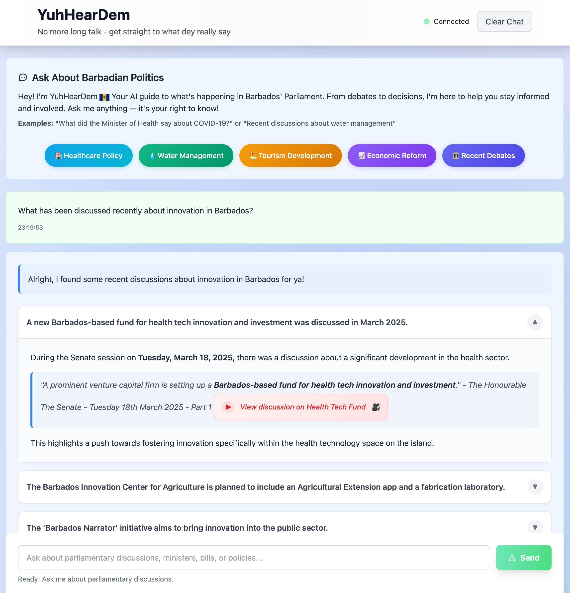

---

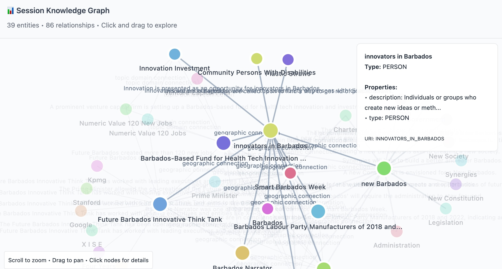

---

# Yuh Gettin Tru?

**Problem:** Product discovery is friction
**Solution:** One search across Barbados stores + vendors

* 350k+ products & services across 110+ stores
* 1,800+ Instagram vendors (micro-business discovery)
* Semantic search: Bajan / US / UK terms + intent ranking

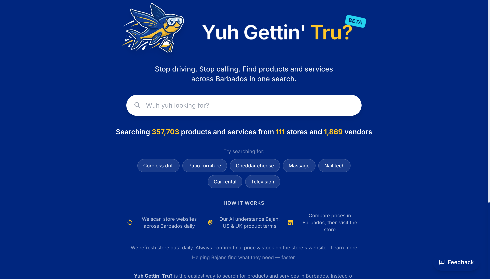

---

---

<!-- _class: lead -->

# Act 3: Context Engineering
## The Technical Magic

---

# What is Context Engineering?

"Prompting is what you say — context is what the model knows when you say it"

Like giving someone the right cookbook before asking them to bake

**For your work:**
- Data cleaning = preserving context
- Data engineering = structuring knowledge  
- Compliance / Privacy = ethical context

---

<!-- _class: lead -->

# Building Context for AI

*From a user message to a clean context pack*


* Query Embedding → Vector Search → Build Context → LLM Call

---

<!-- _class: lead -->

# Prompting Challenge

*Let’s see how well you can talk to an AI!*

---

# Clean the Data!

**Dataset Issues:**

* 🗓️ Mixed date formats
* 📞 Inconsistent phone numbers
* 📍 Location variations
* ❓ Missing values
* 🔢 Invalid entries

**Goal:** Write the best prompt to clean it all.

---

# Rules & Scoring

* ⏱️ 20 minutes
* 🔁 Unlimited submissions
* 🧠 Gemini 2.5 Pro will score
* 🏆 Best score wins!

**Scoring metrics:** Formatting, completeness, accuracy, structure

---
<!-- _class: lead -->

# bit.ly/bim-ai-workshop

---

<!-- _class: lead -->

# Your Context, Your Superpower

---

# The Barbados Advantage

**We're Natural Context Engineers**

- We code-switch daily (formal English ↔️ Bajan)
- We bridge cultures constantly
- We understand nuance and context intuitively

*Our constraints force us to be more creative with context*

---

# You Are Uniquely Positioned

**You've been:**
- ✅ Learning the tools
- ✅ Understanding data at a deep level  
- ✅ Working with real-world applications

**You have what Silicon Valley doesn't:**
- Local context, Cultural understanding, Real problems to solve

---

# The Challenge

Kate Kallot said: 

"The AI revolution is being written in Bridgetown"

**Not despite our context, but because of it**

What problems will you solve that only someone from here could solve?

---

<!-- _class: lead -->

# Final Thought

I came to Barbados for a different life context.

I discovered that context is our competitive advantage.

In AI, context is everything — and you have context that the world needs.

---

# Contact & Resources

**Matt Hamilton**
- GitHub: [@hammertoe](https://github.com/hammertoe)
- LinkedIn: [Matt Hamilton](https://linkedin.com/in/matthamilton)
- Website: [dharach.com](https://dharach.com)

**Learn More:**
- Yuh Gettin Tru?: [yuhgettintru.com](https://yuhgettintru.com)
- YuhHearDem: [yuhheardem.com](https://yuhheardem.com)
- WeOutside246: [weoutside246.com](https://weoutside246.com)
