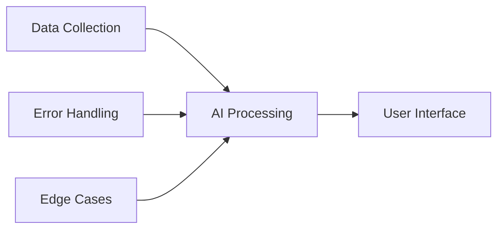

<!-- _class: lead -->
# Leverage AI Tools to Accelerate Learning in Data Science

**Matt Hamilton**  
*Head of DevRel, ASIMOV Protocol*


---

# Personal Journey

**IBM** → **Ripple** → **Protocol Labs** → **Arbitrum** → **ASIMOV Protocol**

- 🏄‍♂️ Moved to Barbados in 2020 on the Welcome Stamp during the pandemic.
- 💻 Head of Developer Relations - working with global AI teams from paradise


---

# Inspiration: Kate Kallot's Vision

**AI for Good Summit 2025, Geneva**

*"The AI revolution is not being written in Silicon Valley. It's coming from Manila, from Bridgetown, from Nairobi, from Accra, from Jakarta, and from Bangui."*

**Key Insights:**
- 90% of data centers in US & China, <1% in Africa
- Constraint-driven creativity is our superpower
- Local context creates competitive advantage


**Watch:** [AI for Good Summit Talk](https://www.youtube.com/live/ETbzT35hRr4?si=qPo7_N-WyyY8DS3Y&t=4611)

---

<!-- _class: lead -->
# The Great Shift

**Yesterday:** Steel mills, factories, centrifuges
**Today:** Laptop + internet connection


Global competition democratized

---

# Barbados Exports Evolution

- **Sugar cane** → Primary export for centuries
- **Tourism** → Economic diversification 
- **Culture** → Music, art, literature
- **?** → What's next?


---

<!-- _class: default -->
# The Global AI Divide: A Problem & Our Superpower

<style scoped>
.two-col {
  display: grid;
  grid-template-columns: 1fr 1fr;
  gap: 2rem;
}
</style>

<div class="two-col">
<div>

### The Problem (Kate Kallot's Insight)
- **Centralization of Power:** 90% of the world's data center capacity is in the US and China.
- **"Happening by Design":** Being left out of the AI future is not an accident. The system is designed to benefit those who build the infrastructure.
- **The Risk:** Becoming low-wage data labelers for Western models instead of authors of our own destiny.

</div>
<div>

### Our Superpower (Kallot's Reframe)
- **Constraint-Driven Creativity:** Limited resources are not a weakness; they are a forcing function for radical innovation and efficiency.
- **Local Context is Key:** It forces us to solve real, tangible problems for our communities.
- **The M-Pesa Example:** Kenya solved mobile payments for the unbanked *long before* Apple Pay because of local constraints.

</div>
</div>

*This isn't a race to catch up. It's a different race, one we are uniquely positioned to lead.*

---

<!-- _class: lead -->
# The Real AI Revolution

**Manila • São Paulo • Nairobi • Bridgetown**

*"Where code meets community, data meets dignity"*


---

# Workshop Goals

✅ **Become AI creators**, not just users
🛠️ **Learn practical tools** & approaches  
💡 **Constraint drives creativity**
🌍 **Local problems, global solutions**

---

# Today's Journey

**Real Projects** → **Toolkit** → **Build** → **Strategy** → **Careers** → **Q&A**

*2 hours to transform from AI consumer to AI creator*

---

<!-- _class: lead -->
# Section 1: Real AI Projects from Barbados

*Local problems, global solutions*

---

# WeOutside246: Event Discovery AI

**Problem:** Events scattered across Instagram stories
**Solution:** AI scraper for fetes, cruises, shows

**Tech Stack:**
- Python + LLMs
- Entity recognition  
- Local slang processing


---

# WeOutside246 Demo

**Input:** Messy IG caption
```
"Big fete this Saturday! DJ Smoke, drinks all night 
at the beach bar thing you know where 🔥🎵"
```

**Output:** Structured event data
```json
{
  "event": "DJ Smoke Fete",
  "date": "2024-01-20",
  "venue": "Beach Bar",
  "type": "fete"
}
```

---

# YuhHearDem: Parliamentary Transparency

**Problem:** Hansard transcripts long & unsearchable
**Solution:** AI-powered knowledge graphs

**Tech:** Gemini, LangChain, MongoDB, vector embeddings

**Demo:** Search parliamentary discussions by topic


---

# ASIMOV Protocol: AI That Actually Knows

**Problem:** LLMs are smart but forgetful, prone to hallucination
**Solution:** Verifiable knowledge graphs for AI reasoning

**Global team:** Poland, Dubai, Ukraine (I lead DevRel from Barbados)

**Comparison:**
- Regular LLM: "I think Barbados population is..."
- ASIMOV: "According to 2022 census data: 281,200"

---

# Positron: Personal Knowledge AI

**Problem:** Information overload, disconnected notes
**Solution:** Second brain that connects your knowledge

**Global development:** International team, Barbados-based strategy

**Demo:** Upload documents → Ask questions across knowledge base

*"What did I learn about machine learning last month?"*

---

# Common Patterns Across Projects

✅ **Structured data** > clever prompts
🎯 **Real problems** drive innovation  
🏝️ **Local context** = competitive advantage
🔧 **Constraint-driven** creativity

*You don't need Silicon Valley to build world-class AI*

---

# Technical Architecture



**Key Components:**
- Data pipelines
- LLM integration  
- User experience
- Scalability planning

---

# Constraint-Driven Creativity

**Limited resources** = Forced efficiency
**Small scale** = Faster iteration  
**Real problems** vs abstract demos

*Kate Kallot: "Innovation thrives where necessity meets ingenuity"*

---

# Key Takeaway

> "You don't need Silicon Valley to build world-class AI"

**Evidence:** WeOutside246 & YuhHearDem built locally, global teams coordinated from Barbados

---

<!-- _class: lead -->
# Section 2: The AI Toolkit

*Essential technologies for building*

---

# Large Language Models

| Model | Best For | Cost | Local Option |
|-------|----------|------|--------------|
| **Gemini** | Multimodal, cheap | $ | No |
| **Claude** | Reasoning, code | $$ | No |
| **GPT-4** | General purpose | $$$ | No |
| **Llama** | Privacy | Free | Yes |

**API considerations for Barbados**

---

# Vector Embeddings & Semantic Search

**How machines understand meaning:**
- Convert text → numbers
- Similar meaning = similar numbers
- Search by concept, not keywords

**Tools:**
- Chroma (local)
- Pinecone (cloud)  
- MongoDB Atlas Search

---

# Knowledge Graphs

**Why structure matters:**
- AI needs memory & context
- Relationships between concepts
- Verifiable information sources

**Technologies:**
- RDF for standards
- Neo4j for graphs
- Simple JSON for prototypes

---

# LangChain & Orchestration

**Connecting LLMs to real data:**

```python
from langchain import OpenAI, VectorStore
from langchain.chains import RetrievalQA

llm = OpenAI()
qa = RetrievalQA.from_chain_type(
    llm=llm,
    retriever=vectorstore.as_retriever()
)
```

**Error handling & retries essential**

---

# Development Environment

**Essential Setup:**
- Python 3.9+ with pip
- VS Code + Python extension
- Git for version control
- API keys management

**Local vs Cloud:**
- Develop locally, deploy cloud
- Mind the data sovereignty

---

# Cost Management

**API Budget Planning:**
- Start with $10/month limits
- Monitor token usage
- Cache expensive operations
- Use cheaper models for development

**Rate limiting strategies**

---

# Toolkit Summary

**Essential Checklist:**
✅ Python environment
✅ LLM API access  
✅ Vector database
✅ Web framework (Streamlit/FastAPI)
✅ Version control

**Resource links:** [QR Code]

---

<!-- _class: lead -->
# 10-Minute Break

☕ Stretch, network, grab refreshments

**Next:** AI Prompting Competition

---

<!-- _class: lead -->
# Section 3: AI Prompting Competition

*Master the art of prompt engineering*

---

# The Challenge

**Your Mission:** Clean messy CSV data using AI prompts

**The Setup:**
- You write prompts for Gemma 2 4B model
- Your prompts must clean provided messy data
- Gemini 2.5 Pro scores your results
- Real-time leaderboard tracks performance

**Goal:** Best prompt engineering wins!

---

# Data Quality Issues to Fix

**What's broken in the data:**
🗓️ **Mixed date formats** - Various representations
📞 **Phone number chaos** - Inconsistent formatting  
📍 **Location variations** - Same place, different names
👤 **Name inconsistencies** - Extra spaces, mixed case
❓ **Missing data** - Different missing value formats
🔢 **Invalid entries** - Impossible dates (month 13)

---

# Competition Format

**Live Scoring:**
- Submit your prompt → Get scored immediately
- Leaderboard updates in real-time
- Multiple attempts allowed (best score counts)
- Rate limited to keep it fair

**Platform:** [Competition URL]


---

# Scoring Criteria (100 Points Total)

**Data Completeness** (20pts) - Handle missing values
**Format Consistency** (20pts) - Standardize formats  
**Location Standardization** (15pts) - Consistent place names
**Data Validity** (15pts) - Fix invalid entries
**Information Preservation** (15pts) - Keep important data
**Overall Cleanliness** (15pts) - General quality

*Gemini 2.5 Pro evaluates each category*

---

# Prompt Engineering Tips

**Effective Strategies:**
```
Be specific: "Convert all dates to YYYY-MM-DD format"
Give examples: "Change 'John  Smith' to 'John Smith'"
Handle edge cases: "If month > 12, treat as day/month"
Preserve data: "Don't remove any rows unless completely empty"
```

**Think like a data analyst giving instructions**

---

# Competition Rules

⏱️ **Duration:** 30 minutes
🔄 **Submissions:** Unlimited (rate limited)
🏆 **Scoring:** Best attempt counts
👥 **Teams:** Individual or pairs
📊 **Transparency:** All scores visible live

**Let the best prompt win!**

---

<!-- _class: lead -->
# Section 4: Strategic AI for the Caribbean

*Our competitive advantages*

---

# Geographic & Cultural Advantages

🌍 **Bridge** between Americas & Europe
🗣️ **Multilingual** populations (EN/ES/FR/NL)
🌊 **Unique challenges** = unique solutions
⚡ **Small scale** = faster iteration


---

# Constraint-Driven Innovation

**Limited resources** → Forced efficiency
**Small markets** → Faster testing  
**Real problems** → Not abstract demos

*Same constraints that drive Caribbean music, art, entrepreneurship*

---

# Climate & Environment Opportunities

🌀 **Hurricane prediction** & response systems
🐠 **Coral reef monitoring** with computer vision
🏖️ **Sustainable tourism** optimization
🌡️ **Climate adaptation** planning tools

*Environmental challenges = AI opportunities*

---

# Governance & Civic Tech

🗳️ **Digital democracy** tools
📊 **Government transparency** systems  
👥 **Citizen engagement** platforms
📋 **Public service** optimization

*Small governments = faster AI adoption*

---

# Cultural Preservation & Education

🗣️ **Dialect preservation** with speech AI
📚 **Personalized education** systems
🎨 **Creative AI** for cultural expression
📖 **Oral history** digitization

*Preserve while innovating*

---

# Regional Integration

🤝 **Cross-island collaboration** tools
⚖️ **Caribbean trade** optimization
📚 **Shared knowledge** systems
🛂 **Regional mobility** platforms

*Think Caribbean-first, then global*

---

<!-- _class: lead -->
# Section 5: Career & Entrepreneurship in AI

*Getting started professionally*

---

# Building Your Portfolio

**Real projects** > tutorial completions
**Open source** contributions
**Global community** networking
**Remote work** from paradise

**Portfolio examples:**
- GitHub with 3-5 AI projects
- Technical blog posts
- Community contributions

---

# Entrepreneurial Opportunities

**B2B AI services** for Caribbean businesses
**Government consulting** on digital transformation
**Global market** tools built from local insight
**Venture funding** landscape for Caribbean startups

*Start local, scale global*

---

# Success Metrics

**Portfolio milestones:**
- First AI project deployed
- 1,000 GitHub stars
- First paid client

**Revenue targets:**
- $1K/month freelancing
- $10K/month consulting  
- $100K+ product revenue

---

<!-- _class: lead -->
# Section 6: Open Q&A & Discussion

*Your questions, our collective wisdom*

---

# Technical Questions

**Implementation challenges**
- Specific tool recommendations
- Architecture decisions
- Performance optimization
- Error handling strategies

**Learning pathways**
- Next steps after today
- Resource recommendations

---

# Discussion Topics

💻 **Technical implementation**
💼 **Career & business development**  
🤔 **Strategic & ethical considerations**
🧠 **Group brainstorming**

*Interactive engagement - your interests drive the conversation*

---

# Lightning Round: Your Ideas

**Share AI project ideas from your context:**
- Tourism challenges
- Local business needs
- Community problems
- Regional opportunities

**Collaboration opportunities**
**Next steps planning**

---

# Community Building

**Join the movement:**
📱 Local AI Discord/WhatsApp community
📅 30-day follow-up session
📚 Resource sharing repository
🤝 Mentorship connections

**QR Code:** [Community Links]

---

<!-- _class: lead -->
# Key Takeaways

✅ **No permission needed** to build world-class AI
💪 **Constraints are advantages**, not limitations  
🌍 **Local problems** make the best global prototypes
🚀 **Start building this week**, not next year

---

<!-- _class: lead -->
# Kate Kallot's Challenge

> "The real AI revolution is being written where code meets community, data meets dignity. Right here in Bridgetown."

**You are the authors of this revolution**

---

<!-- _class: lead -->
# Call to Action

🏗️ **Start building this week**
❤️ **Choose a real problem you care about**
🚢 **Ship messy, iterate fast, learn constantly**
✍️ **You are AI authors, not just users**

---

<!-- _class: lead -->
# Next Steps & Resources

📚 **Resource List:** [QR Code]
👥 **Community Contacts:** [Links]
📅 **30-day Follow-up:** [Calendar]
📧 **Contact:** matt@example.com

**Thank you! Now go build something amazing.**
